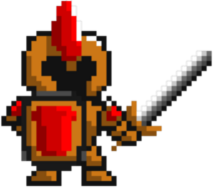
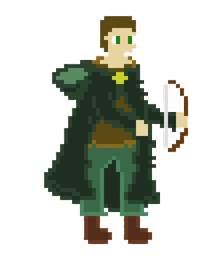

# Restaurator

## Characters

### Warrior
戰士擁有高傷害和高血量,但是移動速度較低

### Wizard
巫師的具有中等程度的攻擊力、血量和移動速度

### Archer
弓箭手的攻擊力和血量較低，但是移動速度最高

## Weapons

### Fireball
火球會繞著角色旋轉，攻擊碰到的敵人

### LaserGun
雷射槍會發射激光，攻擊眼前的敵人

### Katana
武士刀會斬擊敵人，將敵人斬於刀下

### ShockStaff
震擊杖會在角色周圍發射一圈沖擊波，攻擊並擊退敵人

### Whip
鞭子會水平揮舞，攻擊敵人

### Barrier
結界會在角色周圍生成，攻擊進入結界內部的敵人

### 
